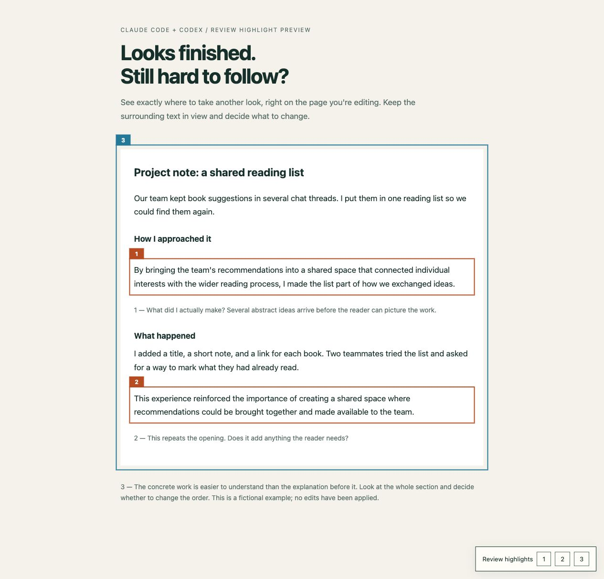

# Review Highlight Preview

**See where polished AI-assisted writing becomes hard to read—right on the page you're working on.**

An open-source skill for **Claude Code and Codex** that highlights passages worth revisiting in your working web preview. See the wording in its layout, follow the surrounding paragraph, and decide what you want to change.

## The problem

An AI-assisted draft can look finished and still be difficult to follow. You reread a sentence without knowing what it means, lose the point in a paragraph, or feel that the words sound polished but say very little.

You ask the agent to look at it. It explains the issue in chat. You ask, "Where?" It quotes a sentence or describes a section—and you still have to search the page and match the explanation to the text.

This skill puts the highlight **at that exact location on the working page**, with the surrounding text and design still visible. Numbers connect the conversation to the page; they are a way to find the passage, not the purpose of the tool.



## What it does

- Shows the sentence or paragraph being discussed directly in the page's existing layout.
- Helps you inspect vague wording, overloaded sentences, repetition, or a jump in the explanation in context.
- Keeps the original wording visible while you decide whether and how to revise it.
- Connects chat feedback to exact locations with numbered outlines and jump links.

Orange outlines mark passages; blue outlines mark broader sections. Highlights live in a temporary local preview and disappear when printing. The source stays unchanged.

This is an **instruction-only skill** for visual support during human editing. It does not automatically rewrite the text or score whether AI wrote it. AI-assisted writing is the main use case, but the same workflow helps with any passage that is hard to follow. A highlight is a point to discuss, not a verdict. Your agent creates the preview using available local tools; you stay in control of the edit.

## Install

Install the same files in either tool's personal skills directory. These commands require Git and a terminal. Choose a destination that does not already exist; review or back up an existing installation before replacing it.

### Claude Code

```sh
mkdir -p "$HOME/.claude/skills"
git clone https://github.com/slowspurt/review_ai_highlight.git \
  "$HOME/.claude/skills/review-highlight-preview"
```

Then ask:

```text
/review-highlight-preview This AI-assisted page looks finished, but parts are hard to follow.
Highlight the passages worth revisiting directly on the page I'm working on.
Keep the wording intact so I can decide what to change.
```

### Codex

```sh
mkdir -p "$HOME/.agents/skills"
git clone https://github.com/slowspurt/review_ai_highlight.git \
  "$HOME/.agents/skills/review-highlight-preview"
```

Then ask:

```text
Use $review-highlight-preview to show exactly where the passages we discussed are.
Highlight them in my current web preview, with the surrounding text visible.
Don't rewrite anything yet.
```

If your existing Codex installation already discovers skills in a different directory, such as `$CODEX_HOME/skills`, use that configured directory instead. Avoid installing duplicate copies under multiple discovered paths. Start a new session if the skill does not appear.

For project-only installation, use `.claude/skills/review-highlight-preview/` for Claude Code or `.agents/skills/review-highlight-preview/` for Codex.

Installation paths and invocation syntax follow the official [Claude Code skills documentation](https://code.claude.com/docs/en/skills) and [Codex skills documentation](https://learn.chatgpt.com/docs/build-skills). Desktop and terminal environments may offer different browser tools.

## How it works

1. You point out a reading difficulty, ask for a readability review, or discuss a passage with the agent.
2. The agent locates the relevant text in the working page. If you have already identified passages, it uses those instead of starting a new review.
3. It adds temporary outlines in the existing layout and connects them to the discussion with numbers.
4. You look at the highlighted text in context and decide what to revise. Changes to the writing remain a separate request.

The implementation uses a temporary HTML copy or a local server that adds annotation markup only to its responses. The original page is not replaced by a separate review report.

In Codex desktop, a supported browser panel can show the preview beside the chat. In Claude Code or another terminal environment, the agent can use an existing browser integration or give you the local URL. Browser automation is optional; without it, the agent reports that visual verification remains pending. Visible labels follow your language, even though the skill instructions are in English.

## Try the example

Open [examples/demo.html](examples/demo.html) locally in a browser, or serve only the example directory from the repository root:

```sh
python3 -m http.server 8790 --bind 127.0.0.1 --directory examples
```

Open `http://127.0.0.1:8790/demo.html`. Use buttons 1–3 to jump between annotations, resize the window to check wrapping, and open print preview to see the annotations disappear. Stop this example server with Ctrl+C when finished.

The example is fictional and self-contained. Python is optional and only used for this example server; the skill does not require a specific server runtime.

## Scope and privacy

The initial workflow targets local HTML documents and previews. PDF, Word, and remote websites need an appropriate local review view first. Preview servers bind to `127.0.0.1`; source documents are not uploaded by this skill. Keep private documents, screenshots, temporary previews, and contact details out of this public repository.

## Updates and contributions

Inside a Git-cloned installation, run `git pull --ff-only` to update. Review local changes before updating; do not discard them automatically.

Keep the skill small and portable. To propose a change, open an issue or pull request with a fictional example and describe which host environment you checked. Browser presentation was checked in Codex desktop; a full Claude Code agent run has not been performed for the initial release.

## License

[MIT](LICENSE).
