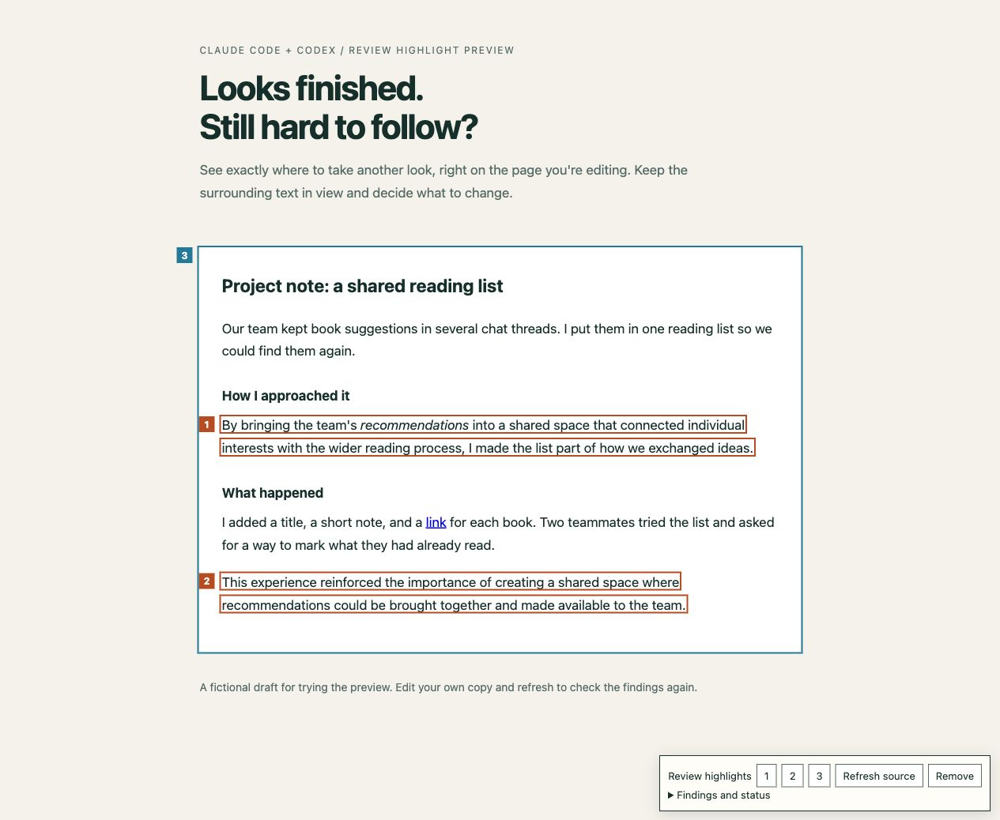

# Review Highlight Preview

**See where polished AI-assisted writing becomes hard to read—right on the page you're working on.**

An open-source skill for **Claude Code and Codex** that highlights passages worth revisiting in your working web preview. See the wording in its layout, follow the surrounding paragraph, and decide what you want to change.

## The problem

An AI-assisted draft can look finished and still be difficult to follow. You reread a sentence without knowing what it means, lose the point in a paragraph, or feel that the words sound polished but say very little.

You ask the agent to look at it. It explains the issue in chat. You ask, "Where?" It quotes a sentence or describes a section—and you still have to search the page and match the explanation to the text.

This skill puts the highlight **at that exact location on the working page**, with the surrounding text and design still visible. Numbers connect the conversation to the page; they are a way to find the passage, not the purpose of the tool.



## What it does

- Shows the sentence or paragraph being discussed directly in the page's existing layout.
- Helps you inspect vague wording, overloaded sentences, repetition, or a jump in the explanation in context.
- Keeps the original wording visible while you decide whether and how to revise it.
- Connects chat feedback to exact locations with numbered outlines and jump links.

Orange outlines mark passages; blue outlines mark broader sections. Highlights live in a temporary local preview and disappear when printing. The source stays unchanged.

The skill provides a **shared local runtime** for Claude Code and Codex. The agent chooses the passages and explains the reading difficulty; reusable code draws outlines, numbers, and navigation. It does not automatically rewrite text or detect AI authorship. A highlight is a point to discuss, not a verdict.

Requirements: **Python 3.10+, Git for installation, and a modern browser with JavaScript**. The preview uses only the Python standard library and browser APIs. No separate paid API, Python package, or browser plugin is required. Your normal agent account is separate from this local runtime.

## Install

Install the same files in either tool's personal skills directory. These commands require Git and a terminal. Choose a destination that does not already exist; review or back up an existing installation before replacing it.

### Claude Code

```sh
mkdir -p "$HOME/.claude/skills"
git clone https://github.com/slowspurt/review_ai_highlight.git \
  "$HOME/.claude/skills/review-highlight-preview"
```

Start a Claude Code session and ask (replace the path with your local HTML):

```text
/review-highlight-preview Show the passages we discussed in /absolute/path/site/page.html.
Keep the original wording and layout. Do not add new findings or rewrite anything.
```

### Codex

```sh
mkdir -p "$HOME/.agents/skills"
git clone https://github.com/slowspurt/review_ai_highlight.git \
  "$HOME/.agents/skills/review-highlight-preview"
```

Start a Codex session and ask:

```text
Use $review-highlight-preview on /absolute/path/site/page.html.
Show exactly where the passages we discussed are, with their surrounding text.
Keep the wording intact and do not add new findings.
```

If your existing Codex installation already discovers skills in a different directory, such as `$CODEX_HOME/skills`, use that configured directory instead. Avoid installing duplicate copies under multiple discovered paths. Start a new session if the skill does not appear.

For project-only installation, use `.claude/skills/review-highlight-preview/` for Claude Code or `.agents/skills/review-highlight-preview/` for Codex.

Installation paths and invocation syntax follow the official [Claude Code skills documentation](https://code.claude.com/docs/en/skills) and [Codex skills documentation](https://learn.chatgpt.com/docs/build-skills). Desktop and terminal environments may offer different browser tools.

## Use it on your page

1. Give the agent your **local HTML path** and the passages already discussed. If you want a new readability review, ask for one explicitly.
2. The agent creates a private findings file and starts the bundled server. Open the local URL it provides; use the numbered buttons to find each passage and expand **Findings and status** for reasons.
3. Edit and save your original HTML as usual. Click **Refresh source** to reread the latest source and findings. If a quote changed, disappeared, or became ambiguous, the mark is withheld with an explanation.
4. Ask the agent to re-examine changed findings when needed. It does not automatically move a mark to a similar sentence.
5. Click **Remove** for the unannotated page. Stop this preview server with Ctrl+C when finished. Your source never contains the annotations.

In Codex desktop the agent can open the preview beside the chat. In Claude Code it can provide the URL or use a browser integration you already have. Without a browser tool, it must say that visual placement is unverified. The toolbar supports English and Korean; reasons follow the user's language.

## Try it without an agent

From the installed skill directory (the directory containing this README):

```sh
python3 scripts/preview.py examples/demo.html \
  --findings examples/findings.json --port 8793
```

Open `http://127.0.0.1:8793/demo.html`. The example is fictional; the HTML contains no built-in review markers. The same runtime used for your own page draws all three findings, including a quote spanning an inline HTML tag. Resize the browser, try the numbered buttons, and check print preview. Use `--port 0` if the suggested port is busy and open the URL printed by the server.

To try editing without changing the installed example, copy the two example files into your own scratch directory. Run the server against that HTML and findings file. Change the first marked sentence, save it, and click **Refresh source**: finding 1 should be withheld as changed while the others remain. **Remove** opens `?review=off`; returning to the original preview URL restores the remaining marks.

For your own static site:

```sh
python3 /path/to/review-highlight-preview/scripts/preview.py /path/to/site/page.html \
  --findings /path/to/private/findings.json --root /path/to/site --port 8793
```

The agent usually writes the small findings JSON for you. [Runtime reference](references/runtime.md) explains its exact-quote format, path mapping, refresh behavior, and troubleshooting.

## Supported inputs and limits

| Input | Support |
| --- | --- |
| Local UTF-8 `.html` / `.htm` path or `file://` URL | Supported |
| Loopback HTTP URL plus `--root` | Maps the URL path to an existing static HTML file; does not proxy the server |
| Relative styles, images, and links within the static root | Preserved under the new preview origin |
| Text split across inline tags, whitespace, and line breaks | Exact normalized matching within one unique CSS scope |
| React / Next.js dev server, SPA routes, hydration | Not validated or claimed as supported |
| Remote sites, login pages, PDF, Word | Not supported by this runtime |
| Iframe/shadow-root text, canvas, transformed/clipped layouts | Outside the validated scope |

A new local preview origin displays the source; the original browser tab is not injected or modified. The runtime does not rewrite absolute URLs or `<base>` tags. Existing source scripts and external assets behave normally. CSP-restricted pages may block the overlay; do not weaken the page's policy to force it to run.

Choose the smallest static asset root, since non-hidden files inside it are locally accessible. The server binds only to `127.0.0.1`, disables caching, blocks directory listings and paths outside that root, and does not upload documents. Keep private findings, documents, and screenshots outside this public repository and preferably outside the served root.

## Validation and development

The shared runtime has automated server and Chromium lifecycle tests. See [validation notes](tests/README.md) for exact coverage, host checks, and limitations. Browser presentation and an agent's ability to follow the skill are separate checks; passing one does not prove the other.

```sh
python3 -m unittest discover -s tests -v
```

Browser tests are optional developer tooling, not an installation requirement:

```sh
npm install --no-save --package-lock=false playwright
npx playwright install chromium
node tests/browser.cjs
```

## Updates and contributions

Inside a Git-cloned installation, inspect `git status`, then run `git pull --ff-only`. Preserve local changes; do not reset an existing installation automatically.

Keep contributions small and source-preserving. Include a fictional reproduction and state which host/browser you checked. Do not add private source material or screenshots to this repository.

## License

[MIT](LICENSE).
